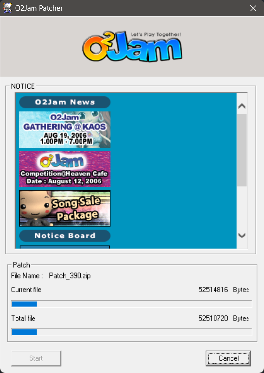

# O2JamPatchServer

An O2Jam patch server in C# on top of [Encore](https://github.com/SirusDoma/Encore), with a built-in FTP server.

<p align="center">
  
</p>

> [!CAUTION]  
> The server serves the patch files over plain, anonymous FTP.  
> Any client that connects to the server over an untrusted network is susceptible to man-in-the-middle attacks.
> 
> Use it only on a trusted network, or better yet, put a reverse-proxy on the client side and use [FTPS](#ftps).

> [!IMPORTANT]  
> The patch URL is hardcoded in `O2JamPatchClient.exe`.  
> Use [Client Patcher](https://sirusdoma.github.io/o2jam-workshop-center/#/tools/client-patcher) to change it.

## How patching works

When the launcher starts, it connects to the TCP patch server and asks for:

- The current launcher (`O2Jam.exe`), patcher (`O2JamPatchClient.exe`), game (`OTwo.exe` and the `Image` assets) and OJNList versions
- The FTP address and path of the patch files (`Patch`)
- The music download location (`Music`)
- The list of game servers (`Gateway`)

It compares each version with the one installed on disk. When the server's version is higher, the patcher downloads the update from the built-in FTP server:

- The launcher, patcher and music list are single files in the `Patch` directory, downloaded as they are.
- Game content comes as zip archives in the `Archive` directory, typically containing updated game assets in the form of `.opi`/`.opa`. The patcher reads the manifest for its installed game version, which lists the archives it still needs, then downloads and extracts them into the game folder in order.

Once everything is up to date, it updates the installed versions in `VersionInfo.dat` or the registry, then starts the game with the configured game servers.

`patch:add` copies the file or builds the archive, rewrites the manifests and raises the version in `config.ini`. The running server serves the new version right away. See [Publishing patches](#publishing-patches) for more details.

Before publishing anything, configure:

- `Server` and `Patch:Address`, so the patcher can reach the server. The patch server address is hardcoded in `O2JamPatchClient.exe` (see the note above).
- `Patch:Path`, `Manifest`, `Patch` and `Archive` to the folder layout your client expects. Old (e-Games, v3.xx) and newer (O2JamO2 NOWCOM, v5.xx) clients look in different directories, hardcoded in `O2JamPatchClient.exe`.
- The four versions in `Patch` to the versions of the client you distribute. Then publish your existing patch files (see [Examples](#examples)).
- `Gateway` to your game servers.

## Build

Install the .NET 10 SDK, then run these commands from the repository root:

1. Restore dependencies: `dotnet restore O2JamPatchServer.sln`
2. Build: `dotnet build O2JamPatchServer.sln -c Release --no-restore -m:2`

The output is written to `Build/<Debug|Release>/O2JamPatchServer/`.

## Configuration

The server can be configured either with [config.ini](Source/O2JamPatchServer/config.ini) or command-line arguments.
See [Command-line configuration provider](https://learn.microsoft.com/en-us/dotnet/core/extensions/configuration-providers#command-line-configuration-provider) to set up command-line config.

`Patch`, `Gateway` and `Music` settings are applied as soon as `config.ini` is saved, without restart. `Server` and `Ftp` settings require a restart.

### Server

Patch TCP server connection setting.

Use `--Server:<Option>` to configure these settings via command-line arguments (e.g. `--Server:Port=15050`)

| Option             | Description                                                                                                                                                             |
|--------------------|-------------------------------------------------------------------------------------------------------------------------------------------------------------------------|
| `Address`          | TCP address to listen incoming connection. Using `0.0.0.0` may require admin privilege. Default: `127.0.0.1`                                                            |
| `Port`             | TCP port to listen incoming connection. Default: `15050`                                                                                                                |
| `MaxConnections`   | The maximum number of clients connecting to the server. Default: system maximum                                                                                         |
| `PacketBufferSize` | The maximum number of bytes per [message frame](https://blog.stephencleary.com/2009/04/message-framing.html) that can be processed by the server. Default: `4096` bytes |

### Patch

Patch FTP location and versions.

Use `--Patch:<Option>` to configure these settings via command-line arguments (e.g. `--Patch:GameVersion=3.58`)

> [!IMPORTANT]
> Versions are always written with two decimals (e.g. `1.06`, not `1.6`).

| Option               | Description                                                                                                                                                                                                                                                                                                                                                 |
|----------------------|-------------------------------------------------------------------------------------------------------------------------------------------------------------------------------------------------------------------------------------------------------------------------------------------------------------------------------------------------------------|
| `Address`            | Patch FTP address. Default: `127.0.0.1`                                                                                                                                                                                                                                                                                                                     |
| `Path`               | Patch FTP path, relative to the FTP root (`Ftp:Root`). Default: `O2Jam/`                                                                                                                                                                                                                                                                                    |
| `Manifest`           | Manifest file path, relative to `Path`.<br/>{GameVersion} is the installed game version: {GameVersion} produces `3.58`, {GameVersion:D3} produces `358`.<ul><li>Old O2Jam: `Patch/PatchInfo/FileList_{GameVersion:D3}.dat`</li><li>Newer O2Jam: `PatchInfo/FileList_{GameVersion:D3}.dat`</li></ul>Default: `Patch/PatchInfo/FileList_{GameVersion:D3}.dat` |
| `Patch`              | Launcher, patcher and music list directory, relative to `Path`.<ul><li>Old O2Jam: `Patch/`</li><li>Newer O2Jam: `O2JamPatch/`</li></ul>Default: `Patch`                                                                                                                                                                                                     |
| `Archive`            | Game patch archive directory, relative to `Path`.<ul><li>Old O2Jam: `Patch/`</li><li>Newer O2Jam: `O2JamPatch/Patch/`</li></ul>Default: `Patch`                                                                                                                                                                                                             |
| `GameVersion`        | Game version (required)                                                                                                                                                                                                                                                                                                                                     |
| `PatchClientVersion` | Patcher version (required)                                                                                                                                                                                                                                                                                                                                  |
| `LauncherVersion`    | Launcher version (required)                                                                                                                                                                                                                                                                                                                                 |
| `MusicListVersion`   | Music list version (required)                                                                                                                                                                                                                                                                                                                               |
| `MinimumGameVersion` | Clients below this version require a full installation. Default: (not configured)                                                                                                                                                                                                                                                                           |

> [!TIP]
> With `Ftp:Root=D:\O2Jam\Public` and `Patch:Path=O2Jam/`, the patch files go in `D:\O2Jam\Public\O2Jam`.

### Gateway
O2Jam Gateway server table.

Use `--Gateway:<N>:<Option>` to configure these settings via command-line arguments (e.g. `--Gateway:0:Port=15010`).
`<N>` is the index in the gateway table. It starts at 0 and must have no gaps.

| Option    | Description                       |
|-----------|-----------------------------------|
| `Address` | Gateway server address (required) |
| `Port`    | Gateway server port (required)    |

### Music

Music FTP location.

Use `--Music:<Option>` to configure these settings via command-line arguments (e.g. `--Music:Port=21`)

> [!NOTE]
> Old O2Jam: The patcher updates charts from `Address`:`Port` in `Patch:Path` + `/Patch/MUSIC/`, ignoring `Path`.  
> Newer O2Jam: The game downloads music from `Path`/O2JamMusic/ on its own servers, ignoring `Address` and `Port`.

| Option    | Description                                                 |
|-----------|-------------------------------------------------------------|
| `Address` | Music FTP address. Default: `127.0.0.1`                     |
| `Port`    | Music FTP port. Default: (not configured)                   |
| `Path`    | Music FTP path, relative to the FTP root. Default: `O2Jam/` |

### Ftp

Built-in FTP server setting. See [FTP server](#ftp-server) for its behavior.

Use `--Ftp:<Option>` to configure these settings via command-line arguments (e.g. `--Ftp:Port=21`)

| Option                | Description                                                                                                                                                                                      |
|-----------------------|--------------------------------------------------------------------------------------------------------------------------------------------------------------------------------------------------|
| `Address`             | FTP address to listen incoming connection. Using `0.0.0.0` may require admin privilege. Default: `127.0.0.1`                                                                                     |
| `Port`                | FTP port to listen incoming connection. Default: `21`                                                                                                                                            |
| `MaxConnections`      | The maximum number of clients connecting to the FTP server. Default: system maximum                                                                                                              |
| `Root`                | Local directory served as the FTP root, relative to the executable or absolute. The root, `Patch` and `Music` paths are created on startup when missing. Default: `Public`                       |
| `Greeting`            | FTP greeting message. Default: `Service ready for new user`                                                                                                                                      |
| `PassiveAddress`      | IPv4 address announced in passive mode, for servers behind NAT or a firewall. Default: (not configured) using the address of the control connection                                             |
| `PassivePortMin`      | Lowest port of the passive mode port range. Default: (not configured) using any free port                                                                                                        |
| `PassivePortMax`      | Highest port of the passive mode port range. Default: (not configured) using any free port                                                                                                       |
| `Tls`                 | FTPS mode. Supported values: <ul><li>`None`: Plain FTP only</li><li>`Explicit`: Plain FTP, secured when the client requests `AUTH TLS`</li><li>`Implicit`: FTPS only</li></ul>See [FTPS](#ftps). Default: `None` |
| `Certificate`         | FTPS certificate, a PKCS#12 (`.pfx`) file or a PEM certificate. Required when `Tls` is not `None`. Default: (not configured)                                                                    |
| `CertificateKey`      | PEM private key of `Certificate`. Default: (not configured)                                                                                                                                      |
| `CertificatePassword` | PKCS#12 password of `Certificate`. Default: (not configured)                                                                                                                                     |

## FTP server

> [!IMPORTANT]  
> The FTP server is implemented from scratch and only has the bare minimum needed to serve the patchers.  
> Some features may not work with common FTP clients.

- Any user name and password are accepted. Files and folders are read-only.
- Only passive mode is supported (`PASV` and `EPSV`). Data connections are accepted only from the address of the control connection.
- File and directory names are matched case-insensitively.
- Hidden and system files are not served.

Set `PassiveAddress` and a `PassivePortMin`/`PassivePortMax` range when the server is behind NAT or a firewall.

### FTPS

`[Ftp] Tls` selects the FTPS mode:

- `None`: plain FTP only.
- `Explicit` ([RFC 4217](https://www.rfc-editor.org/rfc/rfc4217)): plain FTP, secured when the client requests `AUTH TLS`. From then on, commands and file transfers are encrypted; subsequent plain transfers (`PROT C`) are refused.
- `Implicit`: FTPS only, conventionally on port 990.

The certificate can be a PKCS#12 file (`Certificate`, `CertificatePassword`) or a PEM certificate and key pair (`Certificate`, `CertificateKey`).

## Publishing patches

Publish patches with these commands, either typed into the running server's console or passed to the executable (e.g. `O2JamPatchServer patch:status`).
The running server picks up config and manifest changes without restart. Type `help` or `?` in the server console to list the commands.

| Command                            | Description                                                                             |
|------------------------------------|-----------------------------------------------------------------------------------------|
| `patch:add <files>...`             | Publish the launcher, patcher, music list or content and raise their versions           |
| `patch:status`                     | Display the published patches and report inconsistencies                                |

`patch:add` detects the type by file name: `O2Jam.exe` is the launcher, `O2JamPatchClient.exe` the patcher, `*.dat` the music list and anything else content.  

Use `--launcher`, `--patcher`, `--music-list` or `--content` to set the type explicitly, `--version` (single type) or `--<type>-version` to publish as a specific version, and `--skip-version` to publish without raising the versions.
Run `patch:add --help` for the other options.

### Examples

#### Launcher, patcher and music list

Each version goes up by 0.01:

```
patch:add O2Jam.exe O2JamPatchClient.exe OJNList.dat
```

#### Launcher with a different file name

Use `--launcher` when the file isn't named `O2Jam.exe`:

```
patch:add --launcher CustomLauncher.exe
```

#### Game content

Given the following files that serve as a patch to be published as the next game version:

```
Content/
├─ OTwo.exe
├─ Music/
│  └─ o2ma100.ojn
└─ Image/
   ├─ Interface1.opi/          folder: entries to add or replace
   │  └─ Login.ojs
   └─ Avatar.opa               file: a complete package
```

Using:

```
patch:add Content/
```

If `GameVersion` is 3.58, this publishes `Content.zip` as 3.59:

```
Content.zip
├─ OTwo.exe
├─ Music/o2ma100.ojn
└─ Image/Temp/
   ├─ Interface1_359.opi       packed from Image/Interface1.opi/
   └─ Avatar_359.opa           moved from Image/Avatar.opa
```

Use `--skip-packing` if you want to retain original `.opi`/`.opa` files or folders.

#### Archive name and version

Set them yourself with `--content-name` and `--version`:

```
patch:add Content/ --content-name Patch_360 --version 3.60
```

#### Existing patch archives

Import them oldest first, each with the game version it belongs to. `GameVersion` has to start at the version the first archive patches from (3.58 here), or set `MinimumGameVersion` to it:

```
patch:add Patch_359.zip --version 3.59
patch:add Patch_360.zip --version 3.60
```

#### Files already at the current version

Use `--skip-version` to publish files that match the versions in `config.ini` without raising them, for example when moving an existing server:

```
patch:add --skip-version O2Jam.exe O2JamPatchClient.exe OJNList.dat
```
